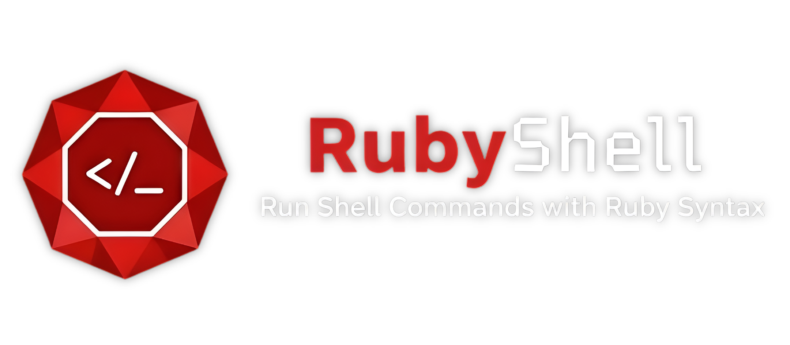

<h1 align="center">
  
</h1>

<h3 align="center">✨ Rubist way to create shell scripts ✨</h3>

<p align="center">
  <a href="https://rubygems.org/gems/rubyshell">
    
  </a>
  <a href="https://rubygems.org/gems/rubyshell">
    
  </a>
  <a href="https://github.com/albertalef/rubyshell/actions/workflows/main.yml">
    
  </a>
  <a href="https://opensource.org/licenses/MIT">
    
  </a>

  <p align="center">
    <a href="#installation">Installation</a>
    ·
    <a href="#usage">Usage</a>
    ·
    <a href="#complete-example">Examples</a>
    ·
    <a href="#contributing">Contributing</a>
    ·
    <a href="#sponsors">Sponsors</a>
  </p>
</p>
<br />
<br />

```ruby
  cd "/log" do
    ls.each_line do |line|
      puts cat(line)
    end
  end
```

Yes, that’s valid Ruby!
`ls` and `cat` are just shell commands, but **RubyShell** makes them behave like Ruby methods.

## Installation

Install the gem and add to the application's Gemfile by executing:

    $ bundle add rubyshell

If bundler is not being used to manage dependencies, install the gem by executing:

    $ gem install rubyshell

## Usage

### Calling a shell command
With RubyShell, every shell command can be used inside the ruby, you just need to call

```ruby
sh do
  puts pwd # => /Users/albertalef/projects/rubyshell
end
```

### Passing arguments
Here we have different ways to pass arguments to a command.
You can separate strings, use only one, use hashes, anyway will work

```ruby
sh do
  docker("ps", all: true) # Using hash syntax = docker ps --all

  docker("ps", a: true) # Using hash syntax = docker ps -a

  docker("ps", '-a') # Passing multiple strings = docker ps -a

  docker("ps -a") # Passing one string = docker ps -a
end
```

### Changing folder
Has two possible ways, changing the folder of the code, or running code only inside a folder 

##### Chaging code folder
```ruby
sh do
  puts pwd # => /Users/albertalef/projects/rubyshell

  cd 'examples'

  puts pwd  # => /Users/albertalef/projects/rubyshell/examples
end
```

##### Executing code inside another folder

```ruby
sh do
  cd 'examples' do
    puts pwd  # => /Users/albertalef/projects/rubyshell/examples
  end

  puts pwd  # => /Users/albertalef/projects/rubyshell
end
```

### Chaining commands
The `chain` method make possible we use shell operators inside the ruby, like `& && | > >> < <<`

```ruby
sh do
  chain { echo "Dummy text" >> "dummy.txt" }
  
  puts cat("dummy.txt") # => "Dummy text"
end

sh do
  number_of_files = chain { ls | wc('-l') }.chomp

  puts number_of_files # => 5
end
```

## Complete example

```ruby
#!/usr/bin/env ruby

require "rubyshell"
require "securerandom"

sh do
  mkdir "files"

  cd "files" do
    5.times do |i|
      chain do
        echo(SecureRandom.alphanumeric(16)) >> "#{i}.txt"
      end
    end

    puts "Number of Files: #{ls.lines.count}"

    ls.each_line do |filename|
      puts cat(filename)
    end
  end
ensure
  rm "-rf files"
end

# Running:
#
# ❯ ./examples/example1.rb
#
# Number of Files: 5
# o6Kw8KHvWJnLGSeQ
# qkRKcZHqu2Moq1se
# nUPluln9GM1ydtoz
# rkdYsc1RBhkeN1dq
# ZPXZMqzYfyFfjPHF
```

## Coming

- Support to Streams

## Development

After checking out the repo, run `bin/setup` to install dependencies. Then, run `rake spec` to run the tests. You can also run `bin/console` for an interactive prompt that will allow you to experiment.

To install this gem onto your local machine, run `bundle exec rake install`. To release a new version, update the version number in `version.rb`, and then run `bundle exec rake release`, which will create a git tag for the version, push git commits and the created tag, and push the `.gem` file to [rubygems.org](https://rubygems.org).

## Contributing

Bug reports and pull requests are welcome on GitHub at https://github.com/albertalef/rubyshell. This project is intended to be a safe, welcoming space for collaboration, and contributors are expected to adhere to the [code of conduct](https://github.com/albertalef/rubyshell/blob/master/CODE_OF_CONDUCT.md).

## Sponsors

<a href="https://avantsoft.com.br">
  
</a>

## License

The gem is available as open source under the terms of the [MIT License](https://opensource.org/licenses/MIT).

## Code of Conduct

Everyone interacting in the Rubysh project's codebases, issue trackers, chat rooms and mailing lists is expected to follow the [code of conduct](https://github.com/albertalef/rubyshell/blob/master/CODE_OF_CONDUCT.md).
